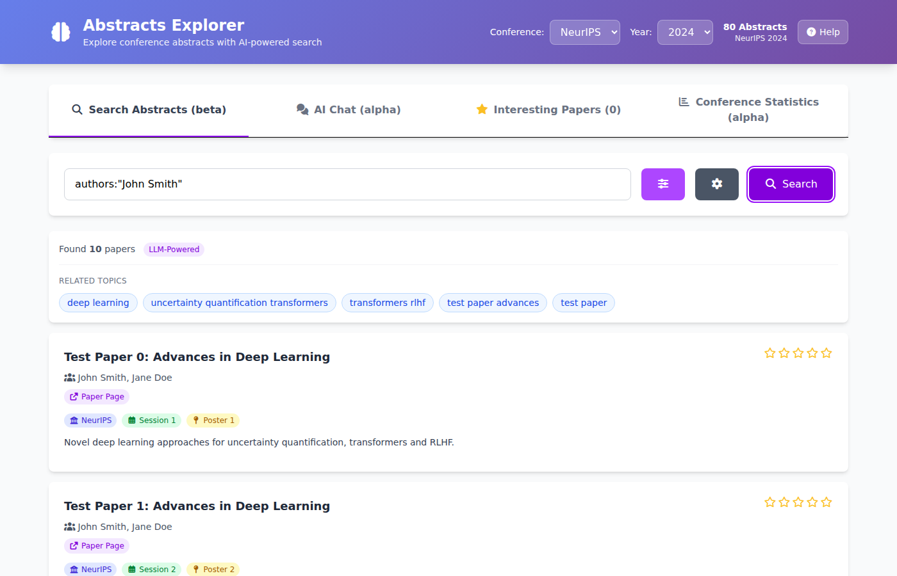
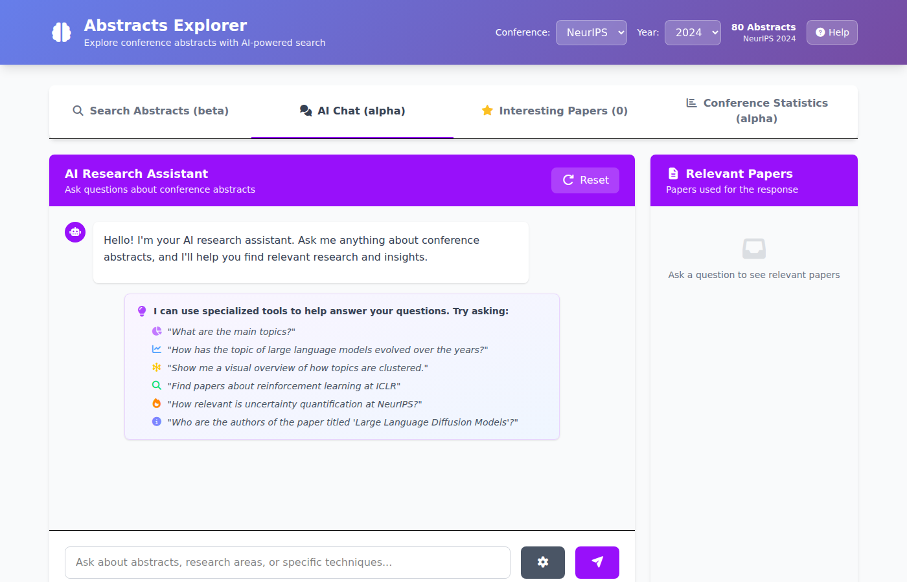
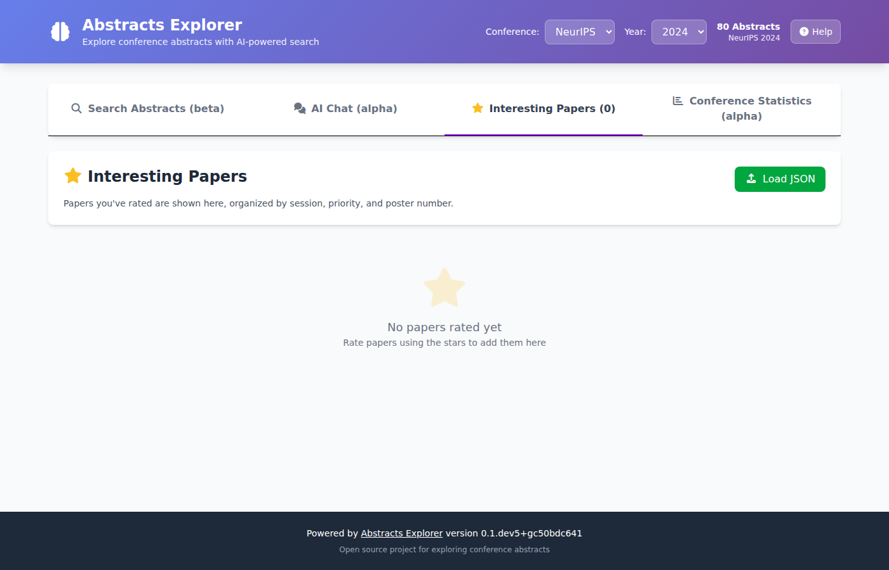
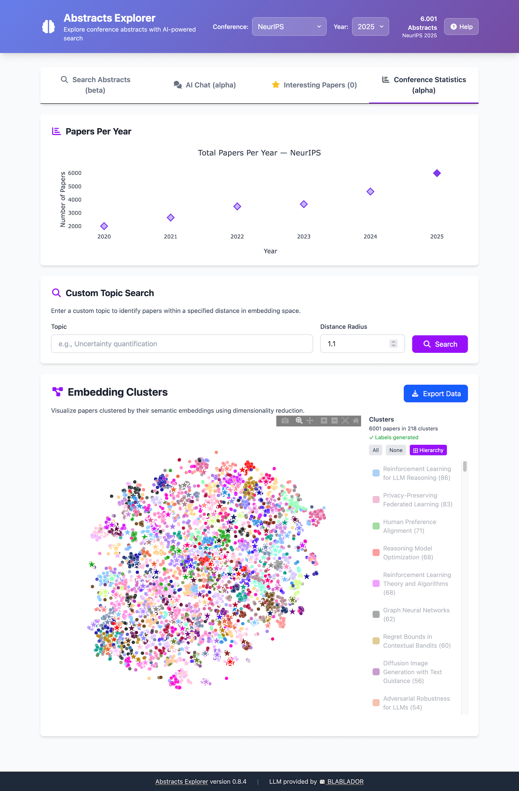
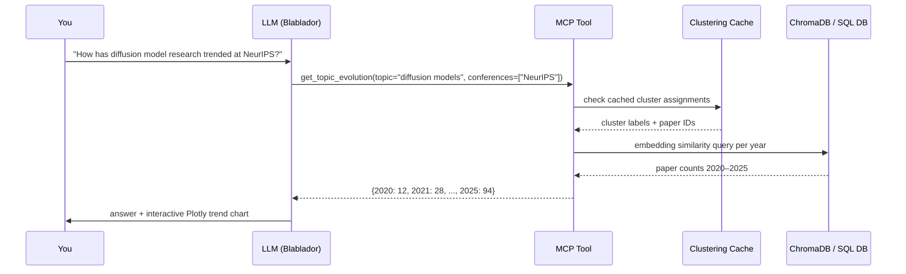
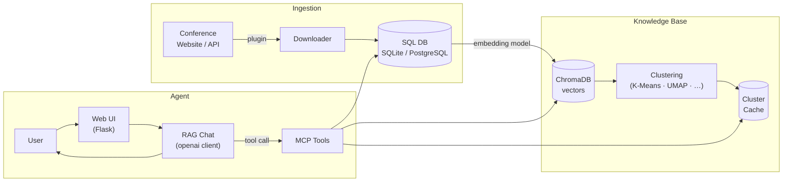

# Abstracts Explorer: Navigating Conference Research with Agentic AI

**Helmholtz AI Conference 2026** — 20-minute talk  
Thomas Wachtler · FZ Jülich  
`https://github.com/thawn/abstracts-explorer`

---
<!-- Slide 1 — Title -->

## Navigate Conference Research with Agentic AI

> You open the conference programme.  
> 400 abstracts. 3 parallel tracks. 2 days.  
> Where do *you* start?

**Traditional approach:** skim titles → miss half the relevant work  
**This talk:** let an AI agent do the heavy lifting — *with you in control*

*[~1 min]*

---
<!-- Slide 2 — Framing -->

## Agentic AI Definition: Goal-Directed, Tool-Using, Multi-Step Reasoning

A system is **agentic** when it can:

1. **Perceive** a goal expressed in natural language
2. **Plan** which tools to invoke
3. **Execute** those tools autonomously
4. **Reflect** on results and loop back

```
User goal → LLM planner → tool calls → results → LLM answer
                 ↑__________feedback loop__________↑
```

> This is exactly what happens inside Abstracts Explorer every time you ask a question - with the user in the loop.

*[~2 min]*

---
<!-- Slide 4 — Demo: Search -->

## Keyword and Semantic Search Put the Right Papers at Your Fingertips



- Keyword search (SQL) **and** semantic search (vector similarity) — side by side
- Filters: conference, year, track, decision type
- Results ranked by relevance

*[~1.5 min]*

---
<!-- Slide 5 — Demo: Chat -->

## Ask Any Question: the AI Reads Relevant Abstracts, Reasons, and Cites Its Sources



**What happens under the hood when you type a question:**

```
1  Query rewriting   →  clarify intent, expand acronyms
2  Abstract retrieval →  top-k similar abstracts from ChromaDB
3  Context assembly  →  retrieved abstracts become the LLM's reading list
4  LLM response      →  grounded answer with cited abstracts
5  Tool invocation   →  if the question needs trend/cluster analysis → MCP
```

*[~2 min]*

---
<!-- Slide 6 — Demo: Interesting Papers + Stats -->

## Rate Papers to Build Your Schedule



**Interesting Papers** (Tab 3)

- Rate abstracts 1–5 stars while browsing
- Export selection as ZIP / JSON / Markdown — ready for your notes app

---

## Visualise the Topic Landscape to Find Trends and Hot Areas

**Conference Statistics** (Tab 4)



- Topic trend chart · cluster landscape (Plotly, interactive)

*[~1.5 min]*

---

## Abstracts Explorer Data Stack

| Layer          | What it does                                             |
| -------------- | -------------------------------------------------------- |
| **Data**       | Downloads & stores abstracts from 10+ conferences        |
| **Embeddings** | Converts abstracts to vectors via an LLM embedding model |
| **Retrieval**  | Keyword (SQL) + semantic (cosine similarity) search      |
| **Reasoning**  | RAG chat: the LLM reads relevant abstracts, then answers |
| **Agency**     | MCP tools: the LLM decides which analysis to run         |
| **Interface**  | Flask web UI — four tabs, no coding required             |

> Open source · Apache-2.0 · runs locally or on a server

*[~1 min]*

---
<!-- Slide 12 — Current Status & Roadmap -->

## Working Today for 8 Conferences

**Today**
- 8 conferences, multi-year data (NeurIPS · ICLR · ICML · CHI · HAICON · …)
  - Plugin sytem makes it easy to add more
- 6 MCP tools, automatic RAG integration
- Conference data registry: share conference data across installations
- > 90 % Python test coverage · Docker deployment

**Planned**
- More agentic behaviours: build personalised schedule based on user prompt, existing ratings, and conference data

*[~1.5 min]*

---
<!-- Slide 7 — The Agentic Layer: MCP -->

## MCP Gives the LLM a Toolbox It Chooses from Autonomously

> MCP is an open standard for exposing **callable tools** to LLMs.  
> The LLM reads the tool descriptions and decides *when and how* to call them.

### The 6 MCP tools in Abstracts Explorer

| Tool                        | Question it answers                                    |
| --------------------------- | ------------------------------------------------------ |
| `get_conference_topics`     | "What are the main themes this year?"                  |
| `analyze_topic_relevance`   | "How prominent is uncertainty quantification?"         |
| `get_topic_evolution`       | "How has diffusion model research trended since 2020?" |
| `search_papers`             | "Find papers about graph neural networks"              |
| `get_cluster_visualization` | "Show me the topic landscape"                          |
| `get_paper_details`         | "Who wrote that? Where is the poster?"                 |

> No special syntax — the LLM picks the right tool from your plain-English question.

*[~2 min]*

---
<!-- Slide 8 — Agentic Loop Diagram -->

## One Question Triggers a Chain of Tool Calls — No Scripting Needed



**Key property:** the LLM may invoke *multiple tools in sequence* before answering.  
That is the agentic behaviour — not scripted, not rule-based.

*[~2 min]*

---
<!-- Slide 9 — Architecture -->

## Three Layers: Ingestion → Knowledge Base → AI Agent



*[~2 min]*

---
<!-- Slide 10 — Why "Agentic"? -->

## Goal-Directed, Tool-Using, Multi-Step, Grounded — This Is Genuine Agency

| Property                 | How Abstracts Explorer satisfies it                             |
| ------------------------ | --------------------------------------------------------------- |
| **Goal-directed**        | Answers open-ended research questions, not just keyword lookups |
| **Tool use**             | LLM autonomously selects among 6 specialised tools              |
| **Multi-step reasoning** | Query rewriting → retrieval → optional tool loop → synthesis    |
| **Grounded**             | Every answer cites the source abstracts                         |
| **Persistent state**     | Conversation history, ratings, cluster cache across sessions    |
| **Human in the loop**    | You steer, rate, and export — the AI handles the scale          |

*[~1.5 min]*

---
<!-- Slide 11 — Deployment -->

## Easily Deploy with Podman Quadlets

Quadlets are `systemd` unit files that describe containers — Podman generates real `.service` units from them automatically.

Advantages:
- Secure: Almost everything runs in user space — root permissions needed only for assigning ports 80 and 443
- Systemd-native service management

Prerequisites: Podman installed, `podman generate systemd` in your PATH, curly installed to download install script.

Single command to install the Quadlets (will ask for your password to set up the ports):

```bash
curl -fsSL https://raw.githubusercontent.com/thawn/abstracts-explorer/main/scripts/install-quadlets.sh | bash
```

*[~2 min]*

---
<!-- Slide 13 — Take-away -->

## Agency Is Most Powerful on Your Data, in Your Infrastructure, With You in Control

> **Agentic AI is most useful when it operates on *your* domain data,  
> in *your* infrastructure, with *you* steering the goals.**

Abstracts Explorer is a small but complete example:

- Domain-specific knowledge base (conference abstracts)  
- Local-first, privacy-respecting (runs on your laptop or institute server)  
- Open tool protocol (MCP) — swap the LLM backend without rewriting the tools  
- Human-in-the-loop design — ratings, export, and curation stay with you

**Come talk to me at the poster!**  
`https://github.com/thawn/abstracts-explorer`

*[~1 min — leaves ~1 min buffer for overrun]*

---

## Backup Slides

### Data Spans Decades: 10+ Conferences from 1994 to 2026

| Conference | Years available |
| ---------- | --------------- |
| NeurIPS    | 2020 – 2025     |
| ICLR       | 2020 – 2026     |
| ICML       | 2020 – 2026     |
| CHI        | 2018 – 2026     |
| HAICON     | 2026            |
| IEEE VIS   | 2025            |
| ML4PS      | 2019 – 2025     |
| IGARSS     | 1994 – 2025     |

---

### Any Conference Can Be Added With a 10-Line Plugin

```python
from abstracts_explorer.plugin import LightweightDownloaderPlugin

class MyConferencePlugin(LightweightDownloaderPlugin):
    name = "myconf"
    
    def download(self, year: int) -> list[dict]:
        # fetch from API / scrape / load JSON
        return [{"title": ..., "abstract": ..., "year": year}]
```

Register in `plugins/__init__.py` → available as  
`abstracts-explorer download --conference myconf --year 2026`

---

### The MCP Tools Work With Any Compatible LLM Client, Not Just Our Chat UI

```
┌──────────────────────────────────────┐
│         Any MCP-compatible LLM       │
│  (Claude · GPT-4o · Blablador · …)   │
└────────────────┬─────────────────────┘
                 │  MCP protocol (JSON-RPC)
┌────────────────▼─────────────────────┐
│       Abstracts Explorer MCP Server   │
│  6 tools · FastMCP · stdio / HTTP     │
└──────────────────────────────────────┘
```

The MCP server can also run standalone — connect it to Claude Desktop,  
Continue.dev, or any other MCP-compatible client.
